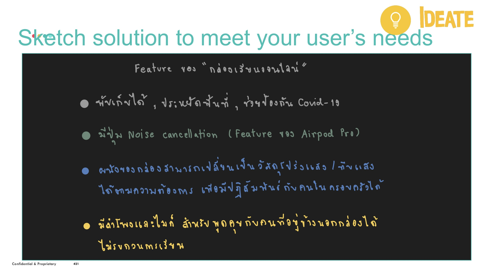

# Design Thinking
## Title : เรียนออนไลน์

## Design Thinking Model

## 1.Empathize - ทำความเข้าใจ

## 2.Define - ตีโจทย์

## 3.Ideate - ระดมความคิด

## 4.Prototype - สร้างต้นแบบ

## 5.Test - ทดสอบ
